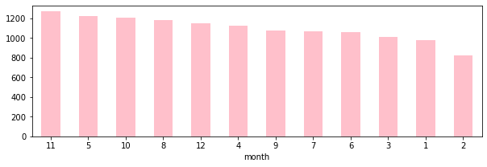
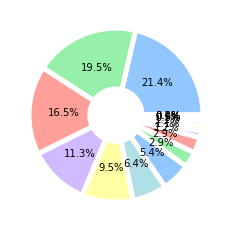
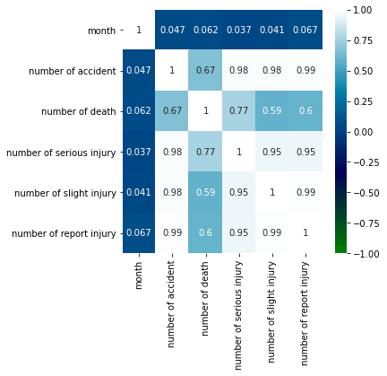
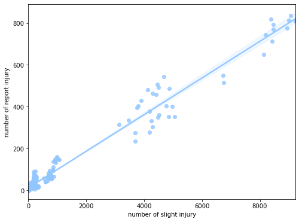

```python
import pandas as pd
import numpy as np
import seaborn as sns
import matplotlib.pyplot as plt
```


```python
accident = pd.read_csv('accident.csv',encoding='cp949')
accident
```


<div>
<style scoped>
    .dataframe tbody tr th:only-of-type {
        vertical-align: middle;
    }

    .dataframe tbody tr th {
        vertical-align: top;
    }

    .dataframe thead th {
        text-align: right;
    }
</style>
<table border="1" class="dataframe">
  <thead>
    <tr style="text-align: right;">
      <th></th>
      <th>사고유형대분류</th>
      <th>사고유형중분류</th>
      <th>사고유형</th>
      <th>월</th>
      <th>사고건수</th>
      <th>사망자수</th>
      <th>중상자수</th>
      <th>경상자수</th>
      <th>부상신고자수</th>
    </tr>
  </thead>
  <tbody>
    <tr>
      <th>0</th>
      <td>차대사람</td>
      <td>횡단중</td>
      <td>횡단중</td>
      <td>1</td>
      <td>1532</td>
      <td>69</td>
      <td>841</td>
      <td>650</td>
      <td>61</td>
    </tr>
    <tr>
      <th>1</th>
      <td>차대사람</td>
      <td>횡단중</td>
      <td>횡단중</td>
      <td>2</td>
      <td>1201</td>
      <td>40</td>
      <td>599</td>
      <td>594</td>
      <td>39</td>
    </tr>
    <tr>
      <th>2</th>
      <td>차대사람</td>
      <td>횡단중</td>
      <td>횡단중</td>
      <td>3</td>
      <td>1453</td>
      <td>47</td>
      <td>736</td>
      <td>709</td>
      <td>61</td>
    </tr>
    <tr>
      <th>3</th>
      <td>차대사람</td>
      <td>횡단중</td>
      <td>횡단중</td>
      <td>4</td>
      <td>1604</td>
      <td>55</td>
      <td>778</td>
      <td>783</td>
      <td>73</td>
    </tr>
    <tr>
      <th>4</th>
      <td>차대사람</td>
      <td>횡단중</td>
      <td>횡단중</td>
      <td>5</td>
      <td>1516</td>
      <td>61</td>
      <td>751</td>
      <td>715</td>
      <td>85</td>
    </tr>
    <tr>
      <th>...</th>
      <td>...</td>
      <td>...</td>
      <td>...</td>
      <td>...</td>
      <td>...</td>
      <td>...</td>
      <td>...</td>
      <td>...</td>
      <td>...</td>
    </tr>
    <tr>
      <th>205</th>
      <td>철길건널목</td>
      <td>철길건널목</td>
      <td>철길건널목</td>
      <td>6</td>
      <td>1</td>
      <td>0</td>
      <td>1</td>
      <td>0</td>
      <td>0</td>
    </tr>
    <tr>
      <th>206</th>
      <td>철길건널목</td>
      <td>철길건널목</td>
      <td>철길건널목</td>
      <td>7</td>
      <td>1</td>
      <td>0</td>
      <td>2</td>
      <td>0</td>
      <td>0</td>
    </tr>
    <tr>
      <th>207</th>
      <td>철길건널목</td>
      <td>철길건널목</td>
      <td>철길건널목</td>
      <td>8</td>
      <td>1</td>
      <td>0</td>
      <td>1</td>
      <td>0</td>
      <td>0</td>
    </tr>
    <tr>
      <th>208</th>
      <td>철길건널목</td>
      <td>철길건널목</td>
      <td>철길건널목</td>
      <td>9</td>
      <td>1</td>
      <td>2</td>
      <td>0</td>
      <td>0</td>
      <td>0</td>
    </tr>
    <tr>
      <th>209</th>
      <td>철길건널목</td>
      <td>철길건널목</td>
      <td>철길건널목</td>
      <td>10</td>
      <td>2</td>
      <td>0</td>
      <td>3</td>
      <td>4</td>
      <td>0</td>
    </tr>
  </tbody>
</table>
<p>210 rows × 9 columns</p>
</div>


# 데이터 설명 
### 주제 : 교통사고 통계

파일명 : 도로교통공단_사고유형별 월별 교통사고 통계

출처 : 공공데이터포털

p.s. 경찰에서 조사, 처리한 교통사고에 대한 통계 정보로 인적 피해가 있는 사고만 집계 됨

- 사고 유형 대분류 
- 사고 유형 중분류
- 사고 유형
- 월
- 사고건수
- 사망자수
- 중상자수
- 경상자수
- 부상신고자수


```python
# 중복되는 칼럼 제거

ac = accident.drop(["사고유형중분류"],1)
ac.head()
```


<div>
<style scoped>
    .dataframe tbody tr th:only-of-type {
        vertical-align: middle;
    }

    .dataframe tbody tr th {
        vertical-align: top;
    }

    .dataframe thead th {
        text-align: right;
    }
</style>
<table border="1" class="dataframe">
  <thead>
    <tr style="text-align: right;">
      <th></th>
      <th>사고유형대분류</th>
      <th>사고유형</th>
      <th>월</th>
      <th>사고건수</th>
      <th>사망자수</th>
      <th>중상자수</th>
      <th>경상자수</th>
      <th>부상신고자수</th>
    </tr>
  </thead>
  <tbody>
    <tr>
      <th>0</th>
      <td>차대사람</td>
      <td>횡단중</td>
      <td>1</td>
      <td>1532</td>
      <td>69</td>
      <td>841</td>
      <td>650</td>
      <td>61</td>
    </tr>
    <tr>
      <th>1</th>
      <td>차대사람</td>
      <td>횡단중</td>
      <td>2</td>
      <td>1201</td>
      <td>40</td>
      <td>599</td>
      <td>594</td>
      <td>39</td>
    </tr>
    <tr>
      <th>2</th>
      <td>차대사람</td>
      <td>횡단중</td>
      <td>3</td>
      <td>1453</td>
      <td>47</td>
      <td>736</td>
      <td>709</td>
      <td>61</td>
    </tr>
    <tr>
      <th>3</th>
      <td>차대사람</td>
      <td>횡단중</td>
      <td>4</td>
      <td>1604</td>
      <td>55</td>
      <td>778</td>
      <td>783</td>
      <td>73</td>
    </tr>
    <tr>
      <th>4</th>
      <td>차대사람</td>
      <td>횡단중</td>
      <td>5</td>
      <td>1516</td>
      <td>61</td>
      <td>751</td>
      <td>715</td>
      <td>85</td>
    </tr>
  </tbody>
</table>
</div>


```python
# 컬럼 이름 다시 지정해주기 
# 시각화 시 한글깨짐 현상을 대비하기 위함 

ac=ac.rename(columns = {
        '사고유형대분류':'large type of accident',
        '사고유형':'type of accident',
        '월':'month',
        '사고건수':'number of accident',
        '사망자수':'number of death',
        '중상자수':'number of serious injury',
        '경상자수':'number of slight injury',
        '부상신고자수':'number of report injury'})
ac
```


<div>
<style scoped>
    .dataframe tbody tr th:only-of-type {
        vertical-align: middle;
    }

    .dataframe tbody tr th {
        vertical-align: top;
    }

    .dataframe thead th {
        text-align: right;
    }
</style>
<table border="1" class="dataframe">
  <thead>
    <tr style="text-align: right;">
      <th></th>
      <th>large type of accident</th>
      <th>type of accident</th>
      <th>month</th>
      <th>number of accident</th>
      <th>number of death</th>
      <th>number of serious injury</th>
      <th>number of slight injury</th>
      <th>number of report injury</th>
    </tr>
  </thead>
  <tbody>
    <tr>
      <th>0</th>
      <td>차대사람</td>
      <td>횡단중</td>
      <td>1</td>
      <td>1532</td>
      <td>69</td>
      <td>841</td>
      <td>650</td>
      <td>61</td>
    </tr>
    <tr>
      <th>1</th>
      <td>차대사람</td>
      <td>횡단중</td>
      <td>2</td>
      <td>1201</td>
      <td>40</td>
      <td>599</td>
      <td>594</td>
      <td>39</td>
    </tr>
    <tr>
      <th>2</th>
      <td>차대사람</td>
      <td>횡단중</td>
      <td>3</td>
      <td>1453</td>
      <td>47</td>
      <td>736</td>
      <td>709</td>
      <td>61</td>
    </tr>
    <tr>
      <th>3</th>
      <td>차대사람</td>
      <td>횡단중</td>
      <td>4</td>
      <td>1604</td>
      <td>55</td>
      <td>778</td>
      <td>783</td>
      <td>73</td>
    </tr>
    <tr>
      <th>4</th>
      <td>차대사람</td>
      <td>횡단중</td>
      <td>5</td>
      <td>1516</td>
      <td>61</td>
      <td>751</td>
      <td>715</td>
      <td>85</td>
    </tr>
    <tr>
      <th>...</th>
      <td>...</td>
      <td>...</td>
      <td>...</td>
      <td>...</td>
      <td>...</td>
      <td>...</td>
      <td>...</td>
      <td>...</td>
    </tr>
    <tr>
      <th>205</th>
      <td>철길건널목</td>
      <td>철길건널목</td>
      <td>6</td>
      <td>1</td>
      <td>0</td>
      <td>1</td>
      <td>0</td>
      <td>0</td>
    </tr>
    <tr>
      <th>206</th>
      <td>철길건널목</td>
      <td>철길건널목</td>
      <td>7</td>
      <td>1</td>
      <td>0</td>
      <td>2</td>
      <td>0</td>
      <td>0</td>
    </tr>
    <tr>
      <th>207</th>
      <td>철길건널목</td>
      <td>철길건널목</td>
      <td>8</td>
      <td>1</td>
      <td>0</td>
      <td>1</td>
      <td>0</td>
      <td>0</td>
    </tr>
    <tr>
      <th>208</th>
      <td>철길건널목</td>
      <td>철길건널목</td>
      <td>9</td>
      <td>1</td>
      <td>2</td>
      <td>0</td>
      <td>0</td>
      <td>0</td>
    </tr>
    <tr>
      <th>209</th>
      <td>철길건널목</td>
      <td>철길건널목</td>
      <td>10</td>
      <td>2</td>
      <td>0</td>
      <td>3</td>
      <td>4</td>
      <td>0</td>
    </tr>
  </tbody>
</table>
<p>210 rows × 8 columns</p>
</div>


```python
ac.columns.values # 컬럼 확인
```


    array(['large type of accident', 'type of accident', 'month',
           'number of accident', 'number of death',
           'number of serious injury', 'number of slight injury',
           'number of report injury'], dtype=object)


```python
type(ac) #데이터프레임 형태
```


    pandas.core.frame.DataFrame


```python
ac.isnull().any().any() # 전체 데이터셋 속 결측치는 없음
```


    False


```python
ac.info() # 전체적 데이터 확인
```

    <class 'pandas.core.frame.DataFrame'>
    RangeIndex: 210 entries, 0 to 209
    Data columns (total 8 columns):
     #   Column                    Non-Null Count  Dtype 
    ---  ------                    --------------  ----- 
     0   large type of accident    210 non-null    object
     1   type of accident          210 non-null    object
     2   month                     210 non-null    int64 
     3   number of accident        210 non-null    int64 
     4   number of death           210 non-null    int64 
     5   number of serious injury  210 non-null    int64 
     6   number of slight injury   210 non-null    int64 
     7   number of report injury   210 non-null    int64 
    dtypes: int64(6), object(2)
    memory usage: 13.2+ KB
    


```python
ac.describe().T # 평균,최대,최소 등 확인
```


<div>
<style scoped>
    .dataframe tbody tr th:only-of-type {
        vertical-align: middle;
    }

    .dataframe tbody tr th {
        vertical-align: top;
    }

    .dataframe thead th {
        text-align: right;
    }
</style>
<table border="1" class="dataframe">
  <thead>
    <tr style="text-align: right;">
      <th></th>
      <th>count</th>
      <th>mean</th>
      <th>std</th>
      <th>min</th>
      <th>25%</th>
      <th>50%</th>
      <th>75%</th>
      <th>max</th>
    </tr>
  </thead>
  <tbody>
    <tr>
      <th>month</th>
      <td>210.0</td>
      <td>6.490476</td>
      <td>3.446433</td>
      <td>1.0</td>
      <td>3.25</td>
      <td>6.5</td>
      <td>9.00</td>
      <td>12.0</td>
    </tr>
    <tr>
      <th>number of accident</th>
      <td>210.0</td>
      <td>1093.333333</td>
      <td>1795.046438</td>
      <td>1.0</td>
      <td>42.00</td>
      <td>293.5</td>
      <td>1448.50</td>
      <td>7806.0</td>
    </tr>
    <tr>
      <th>number of death</th>
      <td>210.0</td>
      <td>15.947619</td>
      <td>16.758690</td>
      <td>0.0</td>
      <td>2.25</td>
      <td>10.0</td>
      <td>24.75</td>
      <td>69.0</td>
    </tr>
    <tr>
      <th>number of serious injury</th>
      <td>210.0</td>
      <td>344.314286</td>
      <td>509.755065</td>
      <td>0.0</td>
      <td>22.50</td>
      <td>120.0</td>
      <td>536.75</td>
      <td>2313.0</td>
    </tr>
    <tr>
      <th>number of slight injury</th>
      <td>210.0</td>
      <td>1169.161905</td>
      <td>2206.423240</td>
      <td>0.0</td>
      <td>19.25</td>
      <td>200.5</td>
      <td>780.75</td>
      <td>9222.0</td>
    </tr>
    <tr>
      <th>number of report injury</th>
      <td>210.0</td>
      <td>113.723810</td>
      <td>196.304494</td>
      <td>0.0</td>
      <td>7.00</td>
      <td>25.0</td>
      <td>80.75</td>
      <td>836.0</td>
    </tr>
  </tbody>
</table>
</div>


# 월별 사고건수 비교 


```python
ac.groupby(['month'])['number of accident'].describe().T # 월별 사고건수의 평균,최대,최소
```


<div>
<style scoped>
    .dataframe tbody tr th:only-of-type {
        vertical-align: middle;
    }

    .dataframe tbody tr th {
        vertical-align: top;
    }

    .dataframe thead th {
        text-align: right;
    }
</style>
<table border="1" class="dataframe">
  <thead>
    <tr style="text-align: right;">
      <th>month</th>
      <th>1</th>
      <th>2</th>
      <th>3</th>
      <th>4</th>
      <th>5</th>
      <th>6</th>
      <th>7</th>
      <th>8</th>
      <th>9</th>
      <th>10</th>
      <th>11</th>
      <th>12</th>
    </tr>
  </thead>
  <tbody>
    <tr>
      <th>count</th>
      <td>17.000000</td>
      <td>18.000000</td>
      <td>18.000000</td>
      <td>17.000000</td>
      <td>17.000000</td>
      <td>18.000000</td>
      <td>18.000000</td>
      <td>17.000000</td>
      <td>18.000000</td>
      <td>18.000000</td>
      <td>17.000000</td>
      <td>17.000000</td>
    </tr>
    <tr>
      <th>mean</th>
      <td>973.647059</td>
      <td>819.555556</td>
      <td>1007.388889</td>
      <td>1123.764706</td>
      <td>1222.294118</td>
      <td>1053.777778</td>
      <td>1068.555556</td>
      <td>1176.000000</td>
      <td>1073.944444</td>
      <td>1205.000000</td>
      <td>1265.705882</td>
      <td>1149.882353</td>
    </tr>
    <tr>
      <th>std</th>
      <td>1548.935519</td>
      <td>1396.238359</td>
      <td>1729.487110</td>
      <td>1861.186400</td>
      <td>2040.059030</td>
      <td>1827.735389</td>
      <td>1853.017102</td>
      <td>1983.787129</td>
      <td>1816.328924</td>
      <td>2045.562284</td>
      <td>2034.125603</td>
      <td>1846.061344</td>
    </tr>
    <tr>
      <th>min</th>
      <td>3.000000</td>
      <td>1.000000</td>
      <td>1.000000</td>
      <td>6.000000</td>
      <td>3.000000</td>
      <td>1.000000</td>
      <td>1.000000</td>
      <td>1.000000</td>
      <td>1.000000</td>
      <td>2.000000</td>
      <td>3.000000</td>
      <td>3.000000</td>
    </tr>
    <tr>
      <th>25%</th>
      <td>35.000000</td>
      <td>41.750000</td>
      <td>52.750000</td>
      <td>77.000000</td>
      <td>145.000000</td>
      <td>51.500000</td>
      <td>52.500000</td>
      <td>105.000000</td>
      <td>57.500000</td>
      <td>56.500000</td>
      <td>101.000000</td>
      <td>76.000000</td>
    </tr>
    <tr>
      <th>50%</th>
      <td>242.000000</td>
      <td>217.000000</td>
      <td>284.500000</td>
      <td>305.000000</td>
      <td>326.000000</td>
      <td>295.500000</td>
      <td>287.000000</td>
      <td>319.000000</td>
      <td>289.000000</td>
      <td>307.000000</td>
      <td>304.000000</td>
      <td>297.000000</td>
    </tr>
    <tr>
      <th>75%</th>
      <td>1507.000000</td>
      <td>956.750000</td>
      <td>1162.500000</td>
      <td>1435.000000</td>
      <td>1516.000000</td>
      <td>1179.000000</td>
      <td>1209.750000</td>
      <td>1372.000000</td>
      <td>1287.250000</td>
      <td>1450.750000</td>
      <td>1730.000000</td>
      <td>1630.000000</td>
    </tr>
    <tr>
      <th>max</th>
      <td>5641.000000</td>
      <td>5397.000000</td>
      <td>6828.000000</td>
      <td>7110.000000</td>
      <td>7781.000000</td>
      <td>7095.000000</td>
      <td>7151.000000</td>
      <td>7504.000000</td>
      <td>6966.000000</td>
      <td>7806.000000</td>
      <td>7450.000000</td>
      <td>6779.000000</td>
    </tr>
  </tbody>
</table>
</div>


```python
# 사고건수가 가장 많은 달부터 나열
import warnings
warnings.filterwarnings('ignore')
g = ac.groupby(['month'])['number of accident'].mean().sort_values(ascending = False)
g.plot(kind='bar',color = 'pink',rot=0,figsize=(10,3))
```


    <AxesSubplot:xlabel='month'>


    

    


# 사고 유형별 사망자수 비교


```python
# 사고 유형별 사망자수 비교 - 내림차순

ac_d = ac.groupby('type of accident')['number of death'].sum().sort_values(ascending = False)
# 사고 유형별 사망자수의 합계
ac_d
```


    type of accident
    기타            716
    횡단중           652
    측면충돌          553
    추돌            379
    공작물충돌         318
    정면충돌          215
    차도통행중         180
    전도             98
    도로이탈 추락        98
    길가장자리구역통행중     41
    보도통행중          37
    전복             36
    도로이탈 기타        18
    주/정차차량 충돌       5
    철길건널목           2
    후진중충돌           1
    Name: number of death, dtype: int64


```python
# 사고 유형별 사망자수 시각화
import warnings
warnings.filterwarnings('ignore')
plt.style.use("seaborn-pastel")
wedgeprops={'width': 0.7, 'edgecolor': 'w', 'linewidth': 5}
plt.pie(ac_d,autopct='%.1f%%', wedgeprops=wedgeprops)
plt.show()
```


    

    


# 상관관계 찾기


```python
ac.corr(method='pearson') # 컬럼 별 상관관계
```


<div>
<style scoped>
    .dataframe tbody tr th:only-of-type {
        vertical-align: middle;
    }

    .dataframe tbody tr th {
        vertical-align: top;
    }

    .dataframe thead th {
        text-align: right;
    }
</style>
<table border="1" class="dataframe">
  <thead>
    <tr style="text-align: right;">
      <th></th>
      <th>month</th>
      <th>number of accident</th>
      <th>number of death</th>
      <th>number of serious injury</th>
      <th>number of slight injury</th>
      <th>number of report injury</th>
    </tr>
  </thead>
  <tbody>
    <tr>
      <th>month</th>
      <td>1.000000</td>
      <td>0.047237</td>
      <td>0.062246</td>
      <td>0.036818</td>
      <td>0.040522</td>
      <td>0.066538</td>
    </tr>
    <tr>
      <th>number of accident</th>
      <td>0.047237</td>
      <td>1.000000</td>
      <td>0.668992</td>
      <td>0.983467</td>
      <td>0.983215</td>
      <td>0.985878</td>
    </tr>
    <tr>
      <th>number of death</th>
      <td>0.062246</td>
      <td>0.668992</td>
      <td>1.000000</td>
      <td>0.768058</td>
      <td>0.589833</td>
      <td>0.596626</td>
    </tr>
    <tr>
      <th>number of serious injury</th>
      <td>0.036818</td>
      <td>0.983467</td>
      <td>0.768058</td>
      <td>1.000000</td>
      <td>0.947131</td>
      <td>0.948879</td>
    </tr>
    <tr>
      <th>number of slight injury</th>
      <td>0.040522</td>
      <td>0.983215</td>
      <td>0.589833</td>
      <td>0.947131</td>
      <td>1.000000</td>
      <td>0.986010</td>
    </tr>
    <tr>
      <th>number of report injury</th>
      <td>0.066538</td>
      <td>0.985878</td>
      <td>0.596626</td>
      <td>0.948879</td>
      <td>0.986010</td>
      <td>1.000000</td>
    </tr>
  </tbody>
</table>
</div>


```python
plt.rcParams["figure.figsize"] = (5,5)
sns.heatmap(ac.corr(),
           annot = True, #실제 값 화면에 나타내기
           cmap = 'ocean', #색상
           vmin = -1, vmax=1 , #컬러차트 영역 -1 ~ +1
          )
```


    <AxesSubplot:>


    

    


heatmap을 봤을때, 
- 사고건수 - 부상신고자수
- 경상자수 - 부상신고자수 

이 0.99로 상관도가 가장 높음을 확인


```python
# 경상자수와 부상신고자수 비례 관계 확인

plt.figure(figsize = (8,6))
sns.regplot(x= ac["number of slight injury"].astype(int),y = ac["number of report injury"].astype(int))
```


    <AxesSubplot:xlabel='number of slight injury', ylabel='number of report injury'>


    

    


# 사고 유형별 사고건수의 비교


```python
# 사고 유형별 사고건수의 합
type_sum = ac.groupby(['type of accident'])['number of accident'].sum().sort_values(ascending = False)
t_s = pd.DataFrame(type_sum)
t_s
```


<div>
<style scoped>
    .dataframe tbody tr th:only-of-type {
        vertical-align: middle;
    }

    .dataframe tbody tr th {
        vertical-align: top;
    }

    .dataframe thead th {
        text-align: right;
    }
</style>
<table border="1" class="dataframe">
  <thead>
    <tr style="text-align: right;">
      <th></th>
      <th>number of accident</th>
    </tr>
    <tr>
      <th>type of accident</th>
      <th></th>
    </tr>
  </thead>
  <tbody>
    <tr>
      <th>측면충돌</th>
      <td>83508</td>
    </tr>
    <tr>
      <th>기타</th>
      <td>67186</td>
    </tr>
    <tr>
      <th>추돌</th>
      <td>34981</td>
    </tr>
    <tr>
      <th>횡단중</th>
      <td>18101</td>
    </tr>
    <tr>
      <th>정면충돌</th>
      <td>7331</td>
    </tr>
    <tr>
      <th>차도통행중</th>
      <td>4765</td>
    </tr>
    <tr>
      <th>공작물충돌</th>
      <td>3586</td>
    </tr>
    <tr>
      <th>후진중충돌</th>
      <td>3075</td>
    </tr>
    <tr>
      <th>길가장자리구역통행중</th>
      <td>2705</td>
    </tr>
    <tr>
      <th>보도통행중</th>
      <td>2335</td>
    </tr>
    <tr>
      <th>전도</th>
      <td>1141</td>
    </tr>
    <tr>
      <th>도로이탈 추락</th>
      <td>443</td>
    </tr>
    <tr>
      <th>도로이탈 기타</th>
      <td>200</td>
    </tr>
    <tr>
      <th>전복</th>
      <td>190</td>
    </tr>
    <tr>
      <th>주/정차차량 충돌</th>
      <td>45</td>
    </tr>
    <tr>
      <th>철길건널목</th>
      <td>8</td>
    </tr>
  </tbody>
</table>
</div>


```python
# 가장 많이 일어나는 사고 유형 나열
import warnings
warnings.filterwarnings('ignore')
t = ac.groupby(['type of accident'])['number of accident'].sum().sort_values(ascending = False)
t.plot(kind='bar',rot=0,figsize=(10,3))
```


    <AxesSubplot:xlabel='type of accident'>


    

    


```python

```
